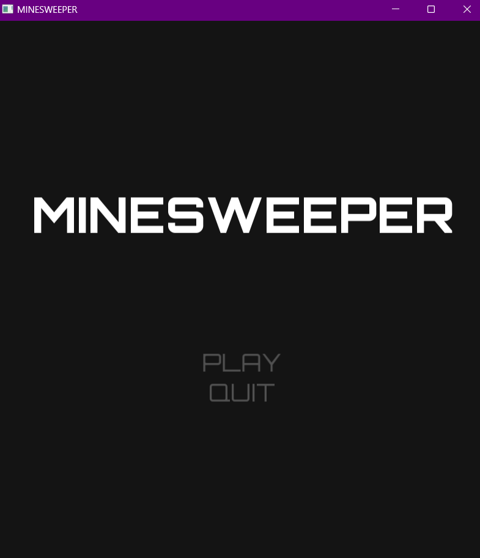
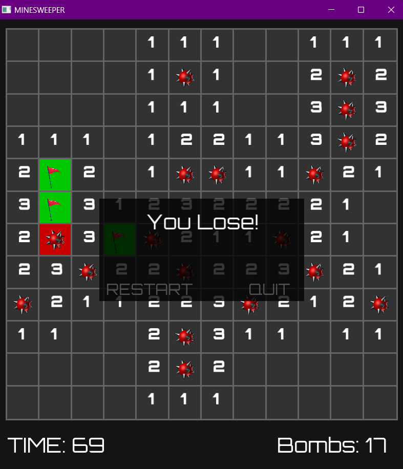

# Minesweeper Game

Welcome to the classic Minesweeper game! This repository contains the source code for a Minesweeper game implemented in C++ with SFML.

## Overview

Minesweeper is a challenging puzzle game where your objective is to uncover all the hidden tiles on the board without triggering any mines. It's a game of skill, strategy, and a little bit of luck!

## How to Play

- **Left-click** on a tile to reveal what's underneath.
- **Right-click** to mark a potential mine with a flag.
- The numbers on the tiles indicate how many mines are adjacent.
- Keep an eye on the timer; it's a race against time!

## Features

- Win the game by successfully revealing all non-mined tiles.
- Lose the game if you accidentally click on a mine.
- Strategic use of flags to mark potential mines.
- Timer to challenge your speed.

## Screenshots

Here are some screenshots from the game:

## Demo Video

Check out the gameplay video on [YouTube](https://youtu.be/dIYr2KqRZmQ) for a visual overview of the game.

Happy Minesweeping! 🚀👾
